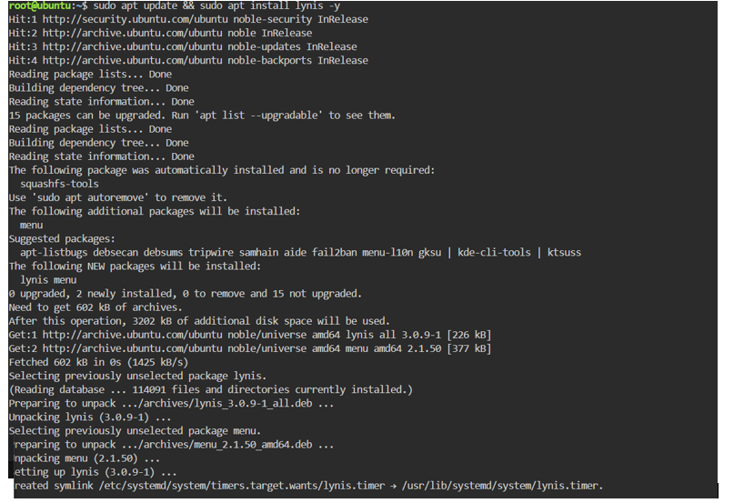

# Laboratório Sessão 5

## Análise de Vulnerabilidades em Linux e Ferramentas de Auditoria

| **Curso \| Reskilling** | Módulo \| Linux e Cibersegurança |
|---|---|
| **Objetivo de Aprendizagem** | OA5 Criar |
| **Duração da prática guiada** | 19:15 – 20:50 |
| **Formador** | Péricles Borges |

---

### Contexto

Execução de um exame de auditoria técnica automatizada para identificar desvios de conformidade em relação aos standards de segurança recomendados (CIS Benchmarks).

### Ambiente Virtual

- **TryHackMe Linux Process Analysis (gratuito):** https://tryhackme.com/room/linuxprocessanalysis
- **KillerCoda Ubuntu Playground:** https://killercoda.com/playgrounds/scenario/ubuntu

### Tarefas a Executar

- [ ] Aceder ao KillerCoda Ubuntu Playground

- [ ] Atualizar a árvore de pacotes e instalar o Lynis:

  ```
  sudo apt update && sudo apt install lynis -y
  ```

  

- [ ] Iniciar a auditoria completa do sistema operativo:

  ```
  sudo lynis audit system
  ```

  

- [ ] Aguardar a conclusão do processo e analisar minuciosamente o output exibido no terminal

- [ ] Localizar a secção de resultados finais e registar:

  - O Hardening Score inicial

    

  - A quantidade de Warnings encontradas

    

    > Warning [PKGS-7392]: Um ou mais pacotes instalados no sistema possuem vulnerabilidades conhecidas.
    >
    > Componentes sem proteção: Scanner de malware ausente `[X]`.

  - A quantidade de Suggestions encontradas

    

- [ ] Escolher 2 Suggestions críticas apresentadas na área de Authentication ou Filesystem e pesquisar a correção recomendada (base de dados Cisofy)

#### Opção 1: Autenticação (Authentication)

- **Sugestão Selecionada:** Fortalecer a complexidade de senhas através de módulos PAM.

  - **Prova no documento:**

    > \* Install a PAM module for password strength testing like pam_cracklib or pam_passwdqc [AUTH-9262]

- **Medida Corretiva:** Instalar e configurar um módulo PAM para validação de complexidade e força de palavras-passe no sistema (ex.: `sudo apt install libpam-cracklib` ou `libpam-pwquality`), impondo regras mínimas para comprimento, caracteres especiais e números.

#### Opção 2: Sistema de Ficheiros (Filesystem)

- **Sugestão Selecionada:** Separar o diretório `/tmp` numa partição dedicada.

  - **Prova no documento:**

    > \* To decrease the impact of a full /tmp file system, place /tmp on a separate partition [FILE-6310]

- **Medida Corretiva:** Montar o diretório `/tmp` numa partição individual ou utilitário tmpfs dedicado (com opções de montagem seguras como `nodev`, `nosuid` e `noexec`). Isso evita que um preenchimento malicioso ou acidental de ficheiros temporários esgote o espaço da partição raiz (`/`), prevenindo ataques de

> ⚠️ **Nota:** o documento original termina aqui — o parágrafo final está incompleto no ficheiro `.docx` de origem.
