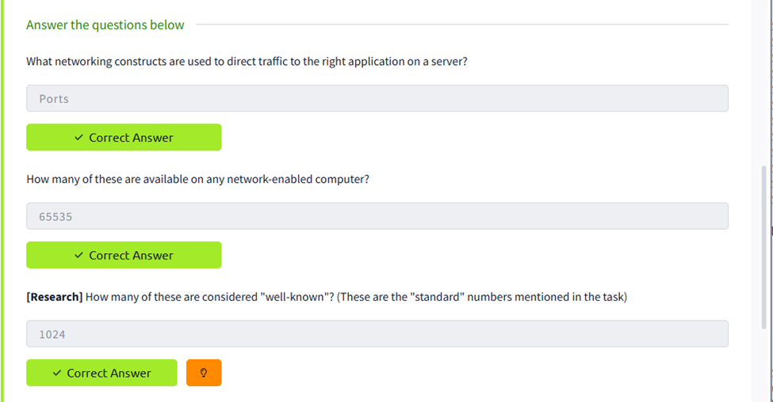

# Linux-Sess-o-1
Executar o comando e identificar o endereço IP da interface principal:
   ip a   
inet 127.0.0.1/8

## Objetivo

Realizar a enumeração dos serviços disponíveis num servidor Linux utilizando o **Nmap**, identificando:

- Portas abertas;
- Serviços em execução;
- Versões detetadas;
- Informações adicionais relevantes.

---

# Questões Teóricas

| Pergunta | Resposta |
|----------|-----------|
| What networking constructs are used to direct traffic to the right application on a server? | **Ports** |
| How many of these are available on any network-enabled computer? | **65535** |
| How many of these are considered "well-known"? | **1024** |

---

# Ambiente

- Sistema Operativo: Ubuntu Linux
- Ferramenta utilizada: Nmap 7.94SVN

---

# Comando Executado

```bash
nmap -sV -sC 10.129.179.192
```

### Opções utilizadas

| Opção | Descrição |
|--------|-----------|
| `-sV` | Deteção da versão dos serviços |
| `-sC` | Execução dos scripts padrão do Nmap |

---

# Resultados Obtidos

| Porta | Protocolo | Estado | Serviço | Versão Detetada | Observações |
|-------|-----------|---------|----------|-----------------|-------------|
| 22 | TCP | Aberta | SSH | OpenSSH 9.6p1 Ubuntu 3ubuntu13.16 | Sistema Linux Ubuntu |
| 53 | TCP | Aberta | DNS | dnsmasq 2.90 | Servidor DNS e encaminhamento |
| 139 | TCP | Aberta | NetBIOS-SSN | Samba smbd 4.6.2 | Partilha de ficheiros/impressoras |
| 445 | TCP | Aberta | SMB | Samba smbd 4.6.2 | SMB sobre TCP/IP. Message Signing ativo mas não obrigatório |
| 7777 | TCP | Filtrada | CBT | Não identificado | Firewall ou serviço inacessível |
| 7778 | TCP | Filtrada | Interwise | Não identificado | Firewall ou serviço inacessível |
| 8443 | TCP | Aberta | HTTPS (SSL) | Amazon DCV | Serviço de desktop remoto seguro |

---

# Output Completo do Nmap

```text
Starting Nmap 7.94SVN ( https://nmap.org ) at 2026-07-13 21:21 UTC

Nmap scan report for 10.129.179.192

Host is up (0.000013s latency).

Not shown: 993 closed tcp ports (reset)

PORT     STATE    SERVICE       VERSION

22/tcp   open     ssh           OpenSSH 9.6p1 Ubuntu 3ubuntu13.16

53/tcp   open     domain        dnsmasq 2.90

139/tcp  open     netbios-ssn   Samba smbd 4.6.2

445/tcp  open     netbios-ssn   Samba smbd 4.6.2

7777/tcp filtered cbt

7778/tcp filtered interwise

8443/tcp open     ssl/https-alt dcv

Host script results:

- SMB Message Signing: enabled but not required
- HTTP Server: dcv
- SSL Certificate:
    - Common Name: ip-172-31-39-192
    - Valid until: 16-02-2027

Service Info:
OS: Linux
```

---

# Análise dos Serviços

## Porta 22/TCP - SSH

- Serviço de acesso remoto seguro.
- OpenSSH versão 9.6p1.
- Utilizado para administração remota do servidor.

---

## Porta 53/TCP - DNS

- Serviço DNS através do **dnsmasq**.
- Responsável pela resolução de nomes e encaminhamento DNS.

---

## Portas 139 e 445/TCP - Samba

O servidor disponibiliza serviços SMB através do Samba.

Características:

- Partilha de ficheiros;
- Partilha de impressoras;
- Compatibilidade com sistemas Windows.

Foi identificado que:

- SMB Message Signing encontra-se **ativado**, mas **não é obrigatório**, o que poderá representar um risco de segurança em determinados cenários.

---

## Portas 7777 e 7778/TCP

Estado:

- **Filtered**

Isto significa que:

- existe uma firewall a bloquear as ligações;
- ou não existe resposta suficiente para identificar o serviço.

---

## Porta 8443/TCP

Serviço identificado:

- Amazon DCV

Características:

- Serviço HTTPS alternativo;
- Plataforma de visualização remota de alta performance;
- Certificado SSL válido.

Servidor HTTP:

```
Server: dcv
```

Título da página:

```
Amazon DCV
```

---

# Considerações de Segurança

Durante a enumeração foram observados alguns pontos importantes:

- SSH exposto na porta 22.
- Serviço DNS acessível.
- Serviços SMB ativos (139 e 445).
- SMB Signing apenas ativado, mas não obrigatório.
- Amazon DCV disponível através da porta 8443.
- Duas portas filtradas por firewall (7777 e 7778).

---

# Conclusão

A enumeração permitiu identificar sete portas relevantes:

- 5 portas abertas;
- 2 portas filtradas.

Os principais serviços encontrados foram:

- SSH
- DNS (dnsmasq)
- Samba (SMB)
- Amazon DCV

O servidor executa um sistema Linux (Ubuntu) e disponibiliza serviços de administração remota, resolução DNS, partilha de ficheiros e acesso remoto gráfico através do Amazon DCV.

---

# Evidência

A imagem abaixo contém as respostas às questões teóricas do exercício.


