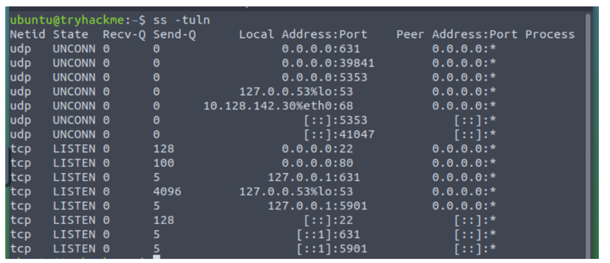
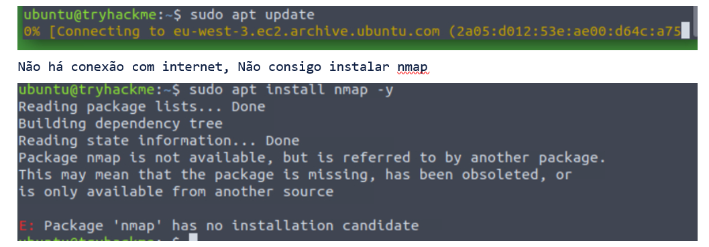

SKODJI DIGITAL

MOD.XX.YY.ZZ

Laboratório – Sessão 6 (Desafio Mini-CTF)

Desafio Prático Integrador Mini-CTF Defensivo Linux

Cenário

O servidor Ubuntu da empresa fictícia "Linux Agency" apresenta indícios de atividade suspeita e configurações severamente inseguras. A sua missão é auditar, conter os danos, aplicar as correções e documentar toda a intervenção como se fosse chamado a responder a um incidente real.

Metodologia de Resposta (Roteiro de Ações Exigidas)

Fase 1 – Identificação e Triagem

☐  Análise de Rede e Portas: Identificar quais os portos e serviços ativos que estão expostos desnecessariamente.

ss –tuln

nmap -sV localhost

Não há conexão com internet, Não consigo instalar nmap

☐  Auditoria de Contas: Procurar por utilizadores com permissões excessivas, contas sem palavra-passe associada ou chaves públicas suspeitas em authorized_keys.

sudo cat /etc/shadow | awk -F: '($2=="") {print $1}'
cat ~/.ssh/authorized_keys

Fase 2 – Contenção

☐  Ativar a firewall UFW: Bloquear todas as portas que não sejam estritamente necessárias para o negócio.

sudo ufw default deny incoming
sudo ufw allow 22/tcp
sudo ufw enable

Fase 3 – Enrijecimento / Remediação

☐  Configuração do SSH: Corrigir a configuração do SSH de acordo com as boas práticas (desativar login root, bloquear passwords, migrar para chaves criptográficas).

☐  Patches de Segurança: Aplicar patches de segurança relevantes identificados durante a triagem.

Validação

☐  Auditoria Lynis: Correr a ferramenta Lynis para atestar a melhoria da postura de segurança global do host.

sudo lynis audit system

Critérios de Entrega Obrigatória (Avaliação)

1. Relatório Técnico de Auditoria e Mitigação: Formato Markdown (README.md), estruturado pelas três fases acima (Identificação, Contenção, Remediação e Validação).

2. Ficheiros de Configuração Corrigidos: Incluídos no repositório (cópia limpa do sshd_config, regras UFW exportadas).

3. Publicação no Portfólio GitHub: Publicação completa deste ecossistema de evidências no Portfólio individual no GitHub, para avaliação formal do formador.

Checklist de Submissão (Portfólio GitHub)
