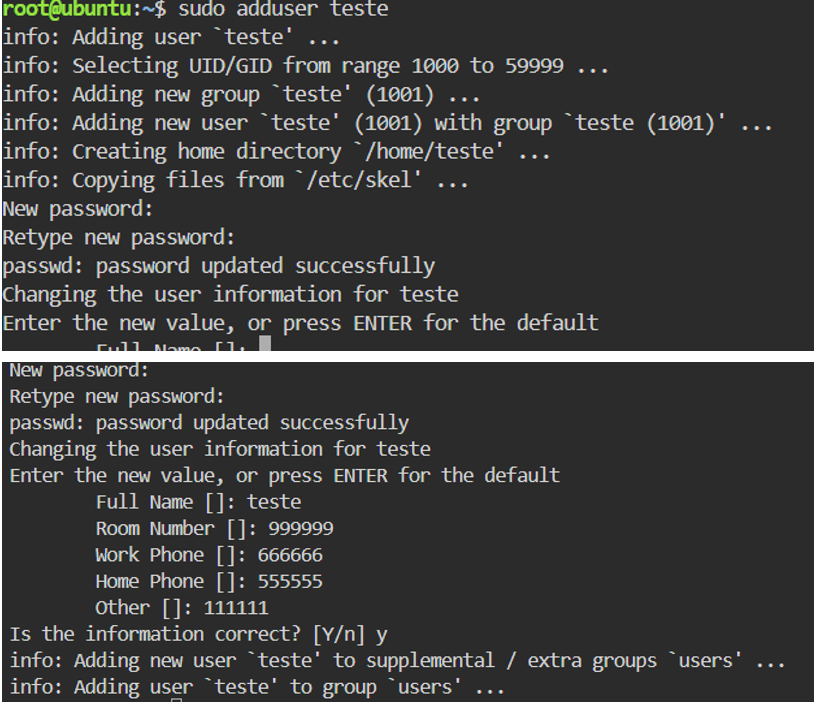
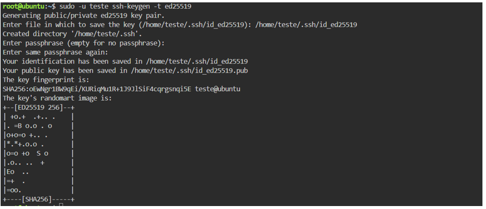
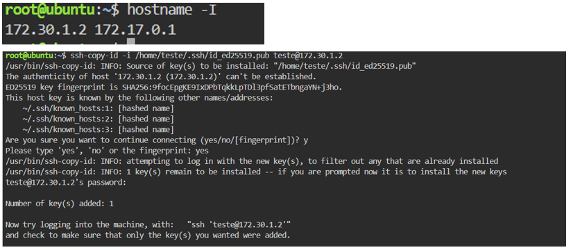
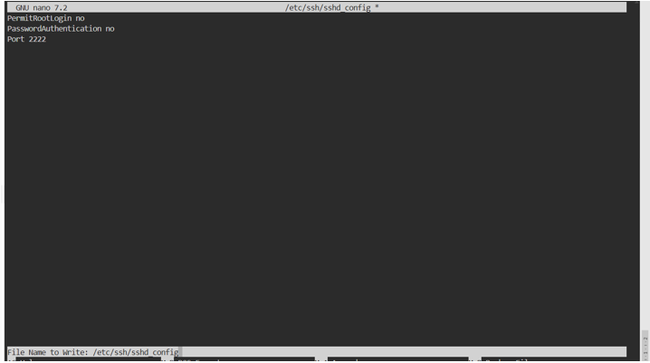
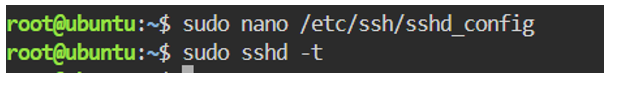
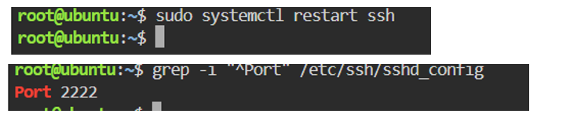
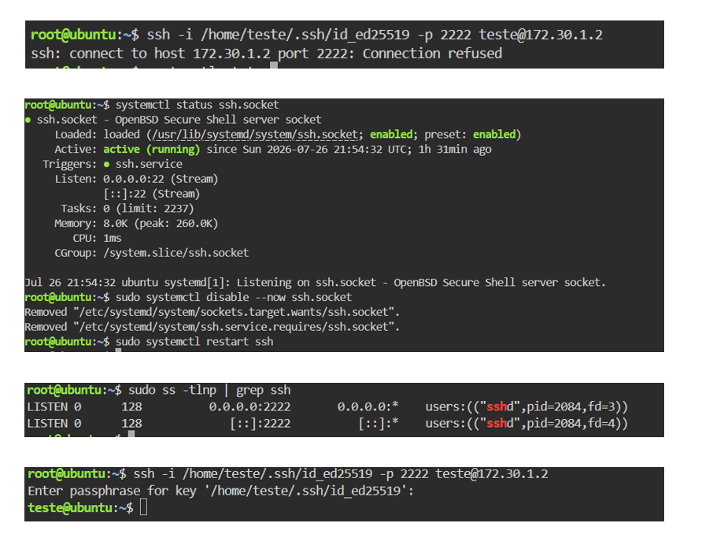

**SKODJI DIGITAL \| MOD.XX.YY.ZZ**

**Guia de Laboratório --- Sessão 4\
Gestão Segura de Acessos Remotos SSH em Linux**

  ------------------------------------------------------------------------------
  **Curso**                       Reskilling
  ------------------------------- ----------------------------------------------
  **Módulo**                      Linux e Cibersegurança

  **Objetivo de Aprendizagem**    OA4. Aplicar

  **Duração da Prática Guiada**   19:15 -- 20:50

  **Formador**                    Péricles Borges
  ------------------------------------------------------------------------------

**1. Contexto**

Proteger o canal de gestão remota do servidor Ubuntu, eliminando a autenticação tradicional por password e migrando para uma abordagem de autenticação criptográfica robusta.

**2. Ambiente Virtual**

-   **TryHackMe --- Linux Strength Training (Gratuito):** https://tryhackme.com/room/linuxstrengthtraining

-   **KillerCoda Ubuntu Playground:** <https://killercoda.com/playgrounds/scenario/ubuntu>

**3. Tarefas a Executar**

> ☐ Criar um novo utilizador de teste no sistema e configurar o ambiente para aceitar chaves.
>
> 
>

☐ Gerar um par de chaves Ed25519 robustas:

Comando: ssh-keygen -t ed25519

> 

☐ Transferir a chave pública para o servidor alvo:\
Comando: ssh-copy-id \<utilizador\>@\<IP_DO_SERVIDOR\>

> 

> ☐ Editar o ficheiro de configuração do daemon SSH com privilégios de superutilizador:\
> Comando: sudo nano /etc/ssh/sshd_config

> ☐ Aplicar e garantir as seguintes alterações estruturais no ficheiro:\
> • PermitRootLogin no\
> • PasswordAuthentication no\
> • Port 2222
> 
> 
>
> ☐ Validar a sintaxe de todas as alterações efetuadas antes de reiniciar o serviço:\
> Comando: sudo sshd --t
>
> 
>
> ☐ Reiniciar o serviço SSH para aplicar as novas diretivas:\
> Comando: sudo systemctl restart sshd
>
> 
>
> ☐ Num novo terminal (sem fechar o atual), testar o acesso completo via chave privada e nova porta:\
> Comando: ssh -i \<caminho_da_chave\> -p 2222 \<utilizador\>@\<IP\>

> 

**4. Critérios de Entrega**

Devem ser documentados os seguintes pontos no portfólio pessoal:

-   Cópia explícita das linhas modificadas e ativas no ficheiro sshd_config

-   Evidência visual ou log de login bem-sucedido utilizando a chave criptográfica (output completo do terminal).
